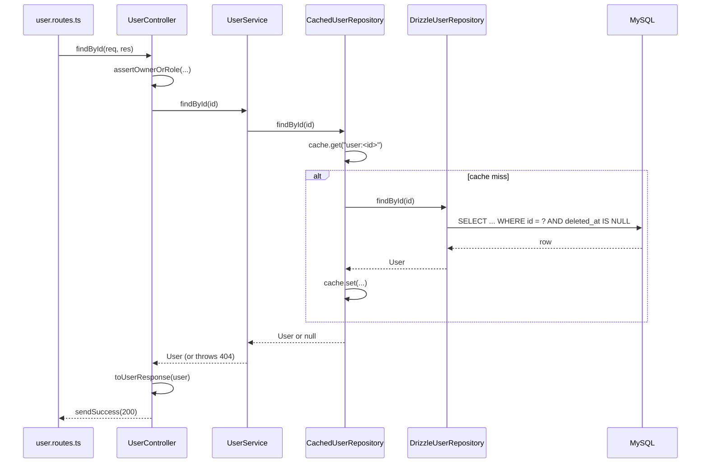

# 04 · Module Architecture

## Goals

By the end of this chapter you will:

- understand **layered architecture** and why each layer exists,
- know the job of each file type in a module (`*.routes.ts`, `*.controller.ts`, `*.service.ts`, ...),
- be able to follow `GET /api/v1/users/:id` through every file of the users module,
- understand **dependency injection**, repository interfaces and the decorator pattern used for caching,
- know how `routes.ts` wires modules together with `create<Name>Module(...)`,
- see why this structure makes testing easy.

## Core concepts

### Why layers?

You _could_ write a whole endpoint in one function: read the request, check permissions, run SQL, format JSON. It works for a demo. It falls apart when:

- the same business rule is needed in two endpoints (copy-paste, then they drift),
- you want to test a rule without starting a server and a database,
- you switch databases (this project moved from SQLite to MySQL; only repositories changed),
- several people work on the code and nobody knows where anything belongs.

Layers solve this by giving each kind of work **one home**. A restaurant again:

| Restaurant      | Layer          | Knows about                               | Does not know about        |
| --------------- | -------------- | ----------------------------------------- | -------------------------- |
| Front door/menu | **Routes**     | URLs, which checks run before the handler | Business rules, SQL        |
| Waiter          | **Controller** | HTTP: reading `req`, sending `res`        | SQL, how rules are applied |
| Chef            | **Service**    | Business rules ("email must be unique")   | HTTP, SQL                  |
| Pantry keeper   | **Repository** | The database and its queries              | HTTP, business rules       |

Dependencies point **one way**: routes → controller → service → repository → database. A repository never imports a controller; a service never touches `req`.

### Dependency injection (DI)

"Dependency injection" sounds fancy but means one simple thing: **a class receives the things it uses instead of creating them itself.**

```ts
// Without DI: the service builds its own repository (hard-wired)
class UserService {
  private repo = new DrizzleUserRepository(
    createDatabase(process.env.DATABASE_URL!),
  );
}

// With DI: someone else decides and passes it in
class UserService {
  constructor(private readonly userRepository: UserRepository) {}
}
```

With DI, the service works with **any** object that has the right methods: the real MySQL repository, a cached one, or a fake in-memory one in a unit test. The place where the real objects are chosen and connected is the **composition root** (here `server.ts` + `routes.ts`).

### Interfaces as contracts

The service depends on an **interface**, a TypeScript description of methods, not on a concrete class:

```ts
// src/modules/users/user.repository.ts
export interface UserRepository {
  findAll(input: FindUsersInput): Promise<FindUsersResult>;
  findById(id: string): Promise<User | null>;
  findByEmail(email: string): Promise<User | null>;
  isEmailTaken(email: string, exceptUserId?: string): Promise<boolean>;
  create(input: CreateUserInput): Promise<User>;
  update(id: string, input: UpdateUserInput): Promise<User | null>;
  updatePasswordHash(id: string, passwordHash: string): Promise<void>;
  updateRole(id: string, role: UserRole): Promise<void>;
  softDelete(id: string): Promise<boolean>;
}
```

Anything that implements these methods can be plugged in. That is the "contract".

## In this boilerplate

### Anatomy of a module

Each feature lives in `src/modules/<name>/`. The users module:

| File                        | Responsibility                                                                                      |
| --------------------------- | --------------------------------------------------------------------------------------------------- |
| `user.entity.ts`            | Internal types: `User`, `CreateUserInput`, `USER_ROLES`... Close to what is stored                  |
| `user.schema.ts`            | Zod schemas for incoming requests (`listUsersQuerySchema`, `userIdParamsSchema`...) and their types |
| `user.routes.ts`            | Which URL + method runs which middleware and controller method                                      |
| `user.controller.ts`        | HTTP only: read params/body, check who may act, call the service, send the response                 |
| `user.service.ts`           | Business rules; throws `HttpError` for expected failures; records audit entries                     |
| `user.repository.ts`        | `UserRepository` interface + `DrizzleUserRepository` (the only code that runs user SQL)             |
| `cached-user.repository.ts` | A `UserRepository` that adds caching around another `UserRepository`                                |
| `user.mapper.ts`            | Turns a `User` entity into the public response shape (drops `passwordHash`!)                        |
| `user.module.ts`            | `createUserModule(deps)`: builds repository → service → controller → router                         |
| `*.test.ts`                 | Tests next to the code they test                                                                    |

Other modules (`authentication`, `files`, `audit`, `health`) follow the same pattern, with only the files they need.

### Following `GET /api/v1/users/:id` through every file

**1. Routes** decide _what runs_ for this URL:

```ts
// src/modules/users/user.routes.ts
router.use(authenticate);
...
router.get(
  "/:id",
  validate({ params: userIdParamsSchema }),
  userController.findById,
);
```

`authenticate` (chapter 7) fills `res.locals.auth`; `validate` (chapter 5) guarantees `req.params.id` is a UUID.

**2. Controller** handles HTTP concerns:

```ts
// src/modules/users/user.controller.ts
findById: RequestHandler<UserIdParamsDto> = async (req, res) => {
  assertOwnerOrRole(getAuth(res), req.params.id, "admin");

  const user = await this.userService.findById(req.params.id);

  sendSuccess(
    res,
    StatusCodes.OK,
    toUserResponse(user),
    "User retrieved successfully",
  );
};
```

- It decides **who may call** (owner or admin). That is about the HTTP caller, so it lives here (chapter 8).
- It does **not** know how users are stored.
- It converts the entity with the mapper, so the password hash can never leak.

**3. Service** applies the rule "a missing user is a 404":

```ts
// src/modules/users/user.service.ts
async findById(id: string): Promise<User> {
  const user = await this.userRepository.findById(id);

  if (!user) throw userNotFound();

  return user;
}
```

`userNotFound()` creates `HttpError.notFound("User not found", { errorCode: "USER_NOT_FOUND" })`. The service throws; it never sends a response itself.

**4. Cached repository** tries the cache first (chapter 10):

```ts
// src/modules/users/cached-user.repository.ts
async findById(id: string): Promise<User | null> {
  const cached = await this.tryCache(() =>
    this.cache.get<CachedUser>(keyOf(id)),
  );
  if (cached) return revive(cached);

  const user = await this.inner.findById(id);
  // Misses are not cached, so a new user is visible right away.
  if (user)
    await this.tryCache(() => this.cache.set(keyOf(id), user, TTL_SECONDS));

  return user;
}
```

**5. Drizzle repository** runs the SQL (chapter 6):

```ts
// src/modules/users/user.repository.ts
async findById(id: string): Promise<User | null> {
  const [user] = await this.db
    .select()
    .from(users)
    .where(and(eq(users.id, id), notDeleted))
    .limit(1);

  return user ?? null;
}
```

**6. Mapper** shapes the output:

```ts
// src/modules/users/user.mapper.ts
export const toUserResponse = (user: User): UserResponse => ({
  id: user.id,
  name: user.name,
  email: user.email,
  role: user.role,
  createdAt: user.createdAt.toISOString(),
  updatedAt: user.updatedAt.toISOString(),
});
```

The whole trip as a diagram:



### The decorator pattern: caching without touching the service

`CachedUserRepository` **implements `UserRepository` and wraps another `UserRepository`**:

```ts
// src/modules/users/cached-user.repository.ts
export class CachedUserRepository implements UserRepository {
  constructor(
    private readonly inner: UserRepository,
    private readonly cache: Cache,
  ) {}
  ...
  async updateRole(id: string, role: UserRole): Promise<void> {
    await this.inner.updateRole(id, role);
    await this.evict(id);
  }
```

Reads may come from the cache; writes go to the inner repository and then remove the cached copy. The service has no idea caching exists: it still talks to "a `UserRepository`". This is the **decorator pattern**: add behavior by wrapping, not by editing. You could remove caching by changing one line in the module file.

### The module factory

Each module exposes one function that builds its parts in the right order:

```ts
// src/modules/users/user.module.ts
export const createUserModule = ({
  db,
  cache,
  authenticate,
  auditService,
}: UserModuleDependencies) => {
  const repository = new CachedUserRepository(
    new DrizzleUserRepository(db),
    cache,
  );
  const service = new UserService(repository, auditService);
  const controller = new UserController(service);

  return {
    router: createUserRouter(controller, authenticate),
    repository,
    service,
  };
};
```

- The parameter type **declares exactly what the module needs** (`db`, `cache`, `authenticate`, `auditService`). Nothing else leaks in.
- It returns the `router` plus things **other modules may reuse** (`repository`, `service`).

### The composition root: `src/routes.ts`

`routes.ts` creates every module once and connects them:

```ts
// src/routes.ts
const tokenService = new TokenService({ ... });
const authenticate = createAuthenticate(tokenService);
const idempotency = createIdempotency(cache);

const health = createHealthModule({ db, redis });
const audit = createAuditModule({ db, authenticate });
const users = createUserModule({
  db,
  cache,
  authenticate,
  auditService: audit.service,
});
const authentication = createAuthenticationModule({
  db,
  redis,
  tokenService,
  authenticate,
  userRepository: users.repository,
  userService: users.service,
  auditService: audit.service,
  jobQueue,
});
```

Reading this file tells you the whole dependency graph:

```
             tokenService ─▶ authenticate ─┬─▶ audit
                                           ├─▶ users ◀── audit.service
                                           ├─▶ authentication ◀── users.repository, users.service,
                                           │                       audit.service, jobQueue
                                           └─▶ files ◀── audit.service, storage, idempotency
```

Because authentication receives `users.repository` (the **cached** one), every write it makes (like a password change) also evicts the cache. If it had built its own `DrizzleUserRepository`, the cache would serve stale data. "Create once, pass around" is not just tidy; it is what keeps the system correct.

### Why this makes testing easy

The unit test for `UserService` needs no database at all. It passes a fake repository that keeps users in an array:

```ts
// src/modules/users/user.service.test.ts
const createFakeRepository = (seed: User[] = []): UserRepository => {
  const users = seed.map((user) => ({ ...user }));
  ...
  return {
    findById: async (id) => find(id),
    isEmailTaken: async (email, exceptUserId) =>
      users.some((u) => u.email === email && u.id !== exceptUserId),
    ...
  };
};
```

And integration tests build the whole app with a test database and in-memory cache/queue through the same `createApp(deps)` (chapter 16). None of this would be possible if classes created their own dependencies.

## Step by step: where does new code go?

Ask these questions in order:

1. Is it about **URLs or which checks run first**? → `*.routes.ts`
2. Is it about **reading the request or shaping the response**, or **who may call**? → `*.controller.ts`
3. Is it a **rule of the business** ("cannot change your own role", "email must be unique")? → `*.service.ts`
4. Is it **how data is read or written**? → `*.repository.ts`
5. Is it **what the client is allowed to see**? → `*.mapper.ts`
6. Is it **what the client must send**? → `*.schema.ts`

## Try it yourself

1. Open `src/modules/users/user.service.ts` and find `changeRole`. Notice that the rule "an admin cannot change their own role" is here, not in the controller. Then try it:

```bash
# You need an admin token. Register, promote with the CLI, then log in again.
curl -s -X POST http://localhost:3000/api/v1/authentication/register \
  -H 'Content-Type: application/json' \
  -d '{"name":"Boss","email":"boss@x.com","password":"correct horse battery"}' > /dev/null
npm run user:make-admin -- boss@x.com
LOGIN=$(curl -s -X POST http://localhost:3000/api/v1/authentication/login \
  -H 'Content-Type: application/json' \
  -d '{"email":"boss@x.com","password":"correct horse battery"}')
ADMIN=$(echo "$LOGIN" | node -pe 'JSON.parse(require("fs").readFileSync(0)).data.accessToken')
ME=$(echo "$LOGIN" | node -pe 'JSON.parse(require("fs").readFileSync(0)).data.user.id')

curl -s -X PATCH "http://localhost:3000/api/v1/users/$ME/role" \
  -H "Authorization: Bearer $ADMIN" -H 'Content-Type: application/json' \
  -d '{"role":"user"}'
# {"statusCode":400,"message":"You cannot change your own role","errorCode":"CANNOT_CHANGE_OWN_ROLE"}
```

2. Run only the service unit tests (no database needed for this file):

```bash
npx vitest run src/modules/users/user.service.test.ts
```

3. Thought experiment: to add caching to the **files** module, which single file would you change, and would `FileService` need to change? (Answer: `file.module.ts`, wrapping the repository; the service stays the same.)

## Common mistakes

- **Business rules in controllers.** They then get duplicated when a second endpoint (or a CLI, or a job) needs the same rule.
- **SQL in services.** Swapping the database or testing the rule becomes hard.
- **Returning entities directly.** Without a mapper, adding a sensitive column to the table leaks it in the API.
- **Each module building its own copy** of a shared repository or service: duplicated pools, stale caches, inconsistent behavior.
- **Interfaces with only one implementation "just because".** Here, `UserRepository` has three (Drizzle, cached, fake in tests), so it pays for itself. Don't add an interface until something actually needs to be swappable.

## Summary

- Each module splits work into routes, controller, service, repository, mapper and schema, with dependencies pointing one way.
- Classes receive their dependencies through constructors (dependency injection); services depend on interfaces, not concrete classes.
- `CachedUserRepository` adds caching by wrapping another repository (decorator pattern), so the service is unchanged.
- `create<Name>Module(deps)` builds a module; `routes.ts` builds every module once and passes shared instances between them (composition root).
- This structure is what makes fakes, in-memory replacements and fast tests possible.

Next: [05 · Validation and error handling](05-validation-and-error-handling.md)
