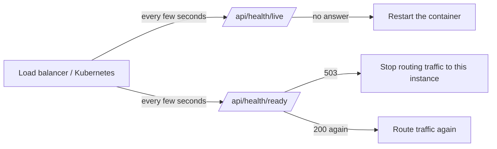

# 15. Observability

## Goals

By the end of this chapter you will:

- know the three classic kinds of observability data (logs, metrics, traces) and which one this boilerplate uses;
- understand how structured JSON logging works with Winston and why it beats `console.log`;
- be able to follow a client's error report to the exact log line with `X-Request-Id`;
- know what must **never** end up in a log;
- understand the difference between the **liveness** and **readiness** health checks and who calls them.

## Core concepts

### What "observability" means

Once your API runs on a server, you cannot attach a debugger to it or watch the terminal. When a user says "it broke at 10:42", you need data the system already recorded to answer **what happened**. Observability is the ability to understand what a running system is doing from the outside, using the data it emits.

Think of an aeroplane: the pilots cannot step outside to look at the engine, so the cockpit is full of instruments, and the flight recorder (black box) records everything for later investigation.

There are three main kinds of data:

| Kind        | What it is                                                      | Example question it answers                       |
| ----------- | --------------------------------------------------------------- | ------------------------------------------------- |
| **Logs**    | Individual events with details ("request X finished with 500")  | "Why did this particular request fail?"           |
| **Metrics** | Numbers aggregated over time (requests per second, p95 latency) | "Is the API slower today than yesterday?"         |
| **Traces**  | The path of one request across several services, with timings   | "Which service made this request take 3 seconds?" |

This boilerplate implements **logs** (structured and correlated by request id) and **health checks**. Metrics and traces are not included; the end of this chapter explains how you would add them.

### Structured logging

A plain log line looks like this:

```
User 42 logged in from 10.0.0.1 in 120ms
```

Humans can read it, but a machine cannot reliably extract "the user id" or "the duration". A **structured** log writes the same event as JSON, with one field per fact:

```json
{
  "level": "info",
  "message": "HTTP request completed",
  "requestId": "3f1c…",
  "method": "POST",
  "path": "/api/v1/authentication/login",
  "statusCode": 200,
  "durationMs": 120,
  "service": "boilerplate-express",
  "timestamp": "2026-10-06T04:52:34.195Z"
}
```

Log platforms (Grafana Loki, Elasticsearch, Datadog, CloudWatch…) index these fields, so you can search for "all requests with `statusCode >= 500` in the last hour" or "everything with `requestId = 3f1c…`".

### Log levels

Each log line has a **level** describing how important it is. Winston uses npm levels, from most to least severe:

```
error > warn > info > http > verbose > debug > silly
```

A logger configured with level `info` writes `error`, `warn` and `info`, and drops the rest. In production you usually want `info`; while developing, `debug` gives more detail.

### Correlation: the request id

A busy server handles many requests at the same time, so their log lines are interleaved. To pick out the lines of **one** request, every line written while handling it carries the same **request id**. If the client also receives that id (in a response header), a user can send it with their bug report, and you can find every related log line in seconds.

### Health checks

A **health check** is an endpoint that tells machines whether the app is OK. Two different questions are asked:

- **Liveness**: "Is the process alive at all?" If not, restart it.
- **Readiness**: "Can it serve traffic right now?" If not, stop sending it requests, but do not necessarily restart it (maybe the database is just restarting).

Mixing them up is a classic mistake: if liveness checked the database, a short database outage would make the orchestrator restart **every** app instance, which helps nobody.

## In this boilerplate

### The logger: `src/config/logger.ts`

```ts
const logFormat = winston.format.combine(
  winston.format.timestamp(),
  winston.format.errors({ stack: true }),
  winston.format.splat(),
  winston.format.json(),
);

export const logger = winston.createLogger({
  level: env.NODE_ENV === "production" ? "info" : "debug",
  format: logFormat,
  defaultMeta: { service: "boilerplate-express" },
  transports: [new winston.transports.Console()],
  // Keep test output readable; assertions check responses, not logs.
  silent: env.NODE_ENV === "test",
});
```

Line by line:

- `timestamp()` adds an ISO `timestamp` field to every line.
- `errors({ stack: true })` makes sure an `Error` object passed to the logger keeps its stack trace instead of turning into `{}`.
- `splat()` supports `printf`-style placeholders (`logger.info("hello %s", name)`).
- `json()` serializes the whole entry as one JSON line.
- `level` is `info` in production and `debug` otherwise.
- `defaultMeta` adds `service: "boilerplate-express"` to every line, which matters once several services send logs to the same platform.
- The only **transport** (destination) is the console (stdout). This follows the [12-factor](17-configuration-and-deployment.md) idea that an app writes logs to stdout and lets the platform (Docker, Kubernetes, a log shipper) collect them. The app never manages log files.
- `silent` turns logging off in tests, so test output shows only test results.

Every part of the code imports this single `logger`; nothing uses `console.log` (ESLint's `no-console` rule enforces that, except in `src/cli/`).

### The request logger: `src/shared/middlewares/request-logger.middleware.ts`

```ts
export const requestLoggerMiddleware: RequestHandler = (req, res, next) => {
  const startedAt = Date.now();

  res.on("finish", () => {
    logger.info("HTTP request completed", {
      requestId: res.locals.requestId,
      method: req.method,
      path: req.originalUrl.split("?")[0],
      statusCode: res.statusCode,
      durationMs: Date.now() - startedAt,
    });
  });

  next();
};
```

Things to notice:

1. It does not log when the request **arrives**; it registers a listener for the response's `finish` event. That way one line contains the **final** status code and the total duration (`durationMs`).
2. `path` drops the query string (`split("?")[0]`). Query strings often carry search terms, emails or even tokens, which are personal or secret data.
3. It is registered second in `src/app.ts`, right after the request id middleware, so even requests rejected later (by CORS, the rate limiter or a 404) are logged.

### The request id: `src/shared/middlewares/request-id.middleware.ts`

```ts
const REQUEST_ID_HEADER = "X-Request-Id";
const VALID_REQUEST_ID = /^[A-Za-z0-9._-]{1,128}$/;

export const requestIdMiddleware: RequestHandler = (req, res, next) => {
  const incoming = req.get(REQUEST_ID_HEADER);
  const requestId =
    incoming && VALID_REQUEST_ID.test(incoming) ? incoming : randomUUID();

  res.locals.requestId = requestId;
  res.set(REQUEST_ID_HEADER, requestId);

  runWithRequestContext({ requestId, ip: req.ip }, next);
};
```

- If a load balancer or another service already sent an `X-Request-Id`, the app **reuses** it, so one id follows the request across services.
- The incoming value is reused only if it matches a strict pattern (letters, digits, `.`, `_`, `-`, at most 128 characters). Otherwise a fresh UUID is generated. Without this check, an attacker could inject newlines or huge strings into your logs (**log injection**).
- The id is stored in `res.locals.requestId` (so the request and error loggers can read it), echoed in the response header, and placed in the request context (see [chapter 14](14-audit-log-and-request-context.md)), where the audit log picks it up.

The error middleware (`src/shared/middlewares/error.middleware.ts`) also includes `requestId` in every error it logs, for example:

```ts
logger.error("Unhandled error", {
  requestId,
  error: error.message,
  stack: error.stack,
});
```

### What is logged, and what is never logged

| Logged                                                     | Never logged                                              |
| ---------------------------------------------------------- | --------------------------------------------------------- |
| Request id, method, path (without query), status, duration | Passwords (not even hashed ones)                          |
| Unexpected errors with their stack                         | Access tokens, refresh tokens, the `Authorization` header |
| The SQL text of a failed query (`query: error.query`)      | The **parameters** of a failed query (user data)          |
| Job name, id and attempt for failed jobs                   | Request bodies                                            |
| "Refresh token reuse detected" with user and family id     | Query strings                                             |

The database case deserves a closer look. In `error.middleware.ts`:

```ts
if (error instanceof DrizzleQueryError) {
  // error.message also contains the query params (user data), so only the
  // SQL text and the driver error are logged.
  const cause = error.cause instanceof Error ? error.cause : undefined;

  logger.error("Database error", {
    requestId,
    query: error.query,
    error: cause?.message ?? String(error.cause),
    stack: cause?.stack,
  });
```

`error.query` is the SQL with `?` placeholders; the values that were bound to it (an email, a password hash…) are deliberately left out.

Also notice that **4xx responses are not logged as errors**. A 404 or a validation error is the client's mistake and is already visible in the request log line. Logging them at `error` level would bury the real problems.

### Health checks: `src/modules/health/`

The service receives a map of named checks:

```ts
/** Named dependency checks; each rejects when its dependency is down. */
export type HealthChecks = Record<string, () => Promise<unknown>>;
```

The module builds that map (`src/modules/health/health.module.ts`):

```ts
const checks: HealthChecks = {
  database: () => db.execute(sql`select 1`),
  ...(redis && { redis: () => redis.ping() }),
};
```

The database is always checked with the cheapest possible query, `select 1`. Redis is checked with `PING` **only if it is configured**; without `REDIS_URL` the key simply does not exist.

`readiness()` runs every check in parallel with `Promise.allSettled` (which, unlike `Promise.all`, waits for all of them even if some fail) and then reports which ones failed:

```ts
if (down.length > 0) {
  throw HttpError.serviceUnavailable(`Unavailable: ${down.join(", ")}`, {
    errorCode: "DEPENDENCY_UNAVAILABLE",
    details: Object.fromEntries(
      names.map((name) => [name, down.includes(name) ? "down" : "up"]),
    ),
  });
}
```

`liveness()` checks nothing external; it only reports uptime and the current time. If the process can answer at all, it is alive.

| Endpoint                | Checks           | Healthy | Unhealthy                                          |
| ----------------------- | ---------------- | ------- | -------------------------------------------------- |
| `GET /api/health/live`  | Nothing external | 200     | No answer at all (process hung or dead)            |
| `GET /api/health/ready` | MySQL (+ Redis)  | 200     | 503 `DEPENDENCY_UNAVAILABLE`, `details` says which |

Health routes are **not versioned** (`/api/health`, not `/api/v1/health`) and not authenticated, because load balancers and orchestrators must call them without tokens, and their URLs should not change when the API gets a v2.

## Step by step

### One request, as seen in the logs

```
Client                           API                                  Logs (stdout)
  |  POST /api/v1/files            |                                       |
  |------------------------------->| requestIdMiddleware: id = 3f1c…       |
  |                                | requestLogger: start timer            |
  |                                | ... route handler throws ...          |
  |                                | errorMiddleware -------------------->  {"level":"error","message":"Unhandled error","requestId":"3f1c…","stack":...}
  |  500 + X-Request-Id: 3f1c…     |                                       |
  |<-------------------------------| res 'finish' ----------------------->  {"level":"info","message":"HTTP request completed","requestId":"3f1c…","statusCode":500,"durationMs":12}
```

### Tracing a bug report

1. A user reports: "Upload failed, the response said `X-Request-Id: 3f1c…`".
2. You search your log platform (or `docker compose logs app | grep 3f1c`) for that id.
3. You find the request line (status, duration, path) **and** the error line with the stack trace.
4. If the user was signed in, the audit log entries of that request carry the same `requestId`, so you also see who did what ([chapter 14](14-audit-log-and-request-context.md)).

### How orchestrators use the health checks



In Kubernetes these map to a `livenessProbe` and a `readinessProbe`. A load balancer typically only uses readiness.

## Try it yourself

Start the API (`npm run dev`) with MySQL and Redis running.

**1. Health checks**

```bash
curl -s http://localhost:3000/api/health/live
# {"statusCode":200,"data":{"status":"OK","uptime":12.3,"timestamp":"..."}}

curl -s http://localhost:3000/api/health/ready
# {"statusCode":200,"data":{"status":"OK",...,"checks":{"database":"up","redis":"up"}}}
```

**2. Readiness when Redis is down**

```bash
docker compose stop redis
curl -s http://localhost:3000/api/health/ready
# {"statusCode":503,"message":"Unavailable: redis","errorCode":"DEPENDENCY_UNAVAILABLE",
#  "details":{"database":"up","redis":"down"}}
curl -s -o /dev/null -w "%{http_code}\n" http://localhost:3000/api/health/live
# 200   <- the process is still alive, so it must not be restarted
docker compose start redis
```

**3. Request ids**

```bash
# A generated id
curl -s -D - -o /dev/null http://localhost:3000/api/health/live | grep -i x-request-id
# X-Request-Id: 9b2d6a3e-...

# A safe incoming id is reused
curl -s -D - -o /dev/null -H "X-Request-Id: my-trace-123" \
  http://localhost:3000/api/health/live | grep -i x-request-id
# X-Request-Id: my-trace-123

# An unsafe one is replaced
curl -s -D - -o /dev/null -H "X-Request-Id: bad id<script>" \
  http://localhost:3000/api/health/live | grep -i x-request-id
# X-Request-Id: <a new UUID>
```

Now look at the terminal running `npm run dev`: you will find a JSON line `"message":"HTTP request completed"` with `"requestId":"my-trace-123"`.

**4. The query string stays out of the logs**

```bash
curl -s "http://localhost:3000/api/nope?token=secret" > /dev/null
```

The log line shows `"path":"/api/nope"`; the token is not there.

## Common mistakes

- **Using `console.log` everywhere.** You get unstructured text without levels or timestamps, and you cannot turn it off in tests. Use one configured logger.
- **Logging request bodies "for debugging".** Bodies contain passwords on `/login` and personal data everywhere else. Once in a log platform, that data is copied, retained and visible to many people.
- **Logging every 4xx as an error.** Alerts fire constantly and real incidents get lost. Expected client errors belong in the request log only.
- **Writing log files from the app.** Files fill disks, need rotation, and vanish with containers. Write to stdout and let the platform collect it.
- **A liveness check that tests dependencies.** A database blip then restarts every instance at once. Keep liveness dependency-free.
- **A readiness check that is too expensive.** It runs every few seconds on every instance. `select 1` and `PING` are cheap on purpose.
- **Trusting an incoming request id blindly.** Validate its shape, as `VALID_REQUEST_ID` does.

## What is not included, and how to add it

**Metrics.** A common setup is [Prometheus](https://prometheus.io/): the app exposes counters and histograms at `GET /metrics`, and Prometheus scrapes them. With the `prom-client` package you would:

1. create a histogram such as `http_request_duration_seconds` with labels `method`, `route`, `status`;
2. observe it in a middleware on `res.on("finish")`, just like the request logger does (use the **route pattern**, e.g. `/v1/users/:id`, not the actual path, or every user id becomes a separate time series);
3. expose `/metrics` on a port or path that is not public.

**Tracing and APM.** [OpenTelemetry](https://opentelemetry.io/) can instrument Express, mysql2 and ioredis automatically. It is loaded before the app starts (for example `node --require ./tracing.js dist/server.js`) and sends spans to a backend such as Jaeger, Tempo or a commercial APM. You could then add the trace id to log lines next to `requestId`.

**Error tracking.** Services like Sentry group identical exceptions and alert you. They are typically wired into the error middleware, in the branch that handles unexpected errors.

## Summary

- Logs are JSON lines on stdout, written through one Winston logger, silent in tests, `info` level in production.
- Every request gets a validated `X-Request-Id`, returned to the client and included in request, error and audit logs, so a bug report leads straight to the right lines.
- Secrets and personal data (passwords, tokens, query strings, query parameters, bodies) are never logged; expected 4xx responses are not logged as errors.
- `/api/health/live` answers "is the process alive?", `/api/health/ready` answers "are MySQL (and Redis) reachable?" and returns 503 `DEPENDENCY_UNAVAILABLE` with per-dependency `details`.
- Metrics and tracing are not built in, but slot in through a middleware and OpenTelemetry.

Next: [16. Testing](16-testing.md)
